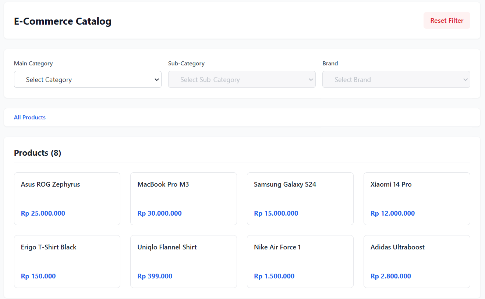
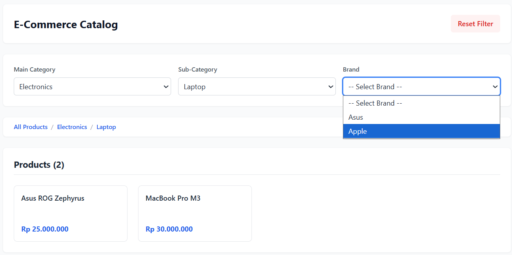

<div align="center">

# 🛒 E-Commerce Catalog

### Dynamic Product Catalog with Cascading Filters, URL-Based State Management, and Responsive UI

A modern **React** application that demonstrates scalable frontend architecture through **cascading dropdown filters**, **URL-driven state management**, and **derived state computation** without relying on external state management libraries.

<br>


---

A frontend technical challenge showcasing modern React development practices, responsive UI design, and clean state management using URL search parameters.

</div>

---

# 📖 Overview

This project is a responsive **E-Commerce Product Catalog** built with **React**, **Vite**, **React Router**, and **Tailwind CSS**.

The primary objective of this challenge is to demonstrate how dependent UI components can be managed efficiently without introducing unnecessary application state.

Instead of using Redux, Zustand, Context API, or local component state for filters, this application uses **URL Search Parameters** as the **single source of truth**, resulting in a predictable, shareable, and maintainable architecture.

---

# 📸 Preview

## 🏠 Initial State

<p align="center">
    
</p>

On the initial page load:

- All products are displayed.
- Only **Main Category** is enabled.
- Sub Category and Brand selectors remain disabled until the previous selection is made.

---

## 🔄 Cascading Filter

<p align="center">
    
</p>

Once a category is selected:

- Sub Category becomes available.
- Brand becomes available after selecting a Sub Category.
- Products are filtered instantly.
- Breadcrumb navigation updates automatically.
- URL parameters synchronize with the selected filters.

---

# ✨ Features

- 🔗 URL-based state management
- 🔄 Cascading dropdown filters
- 📦 Dynamic product filtering
- 🧭 Dynamic breadcrumb navigation
- ⚡ Derived state architecture
- 📱 Fully responsive design
- ♿ Semantic HTML & accessibility
- 🚀 Lightning-fast development with Vite
- 🎯 Strict DOM specification compliance
- 🔍 Shareable and bookmarkable filter URLs

---

# 🏗️ Application Flow

```text
                   URL Search Parameters
                           │
                           ▼
                 useSearchParams()
                           │
                           ▼
                Derived Application State
          ┌──────────────┬──────────────┐
          ▼              ▼              ▼
     Categories    Sub Categories     Brands
             └──────────────┬──────────────┘
                            ▼
                   Filtered Product List
                            ▼
                     Responsive UI
```

The browser URL serves as the application's **single source of truth**, allowing every UI component to derive its state without duplicated React state.

---

# 💡 Engineering Decisions

## 1. URL-Based State Management

Instead of storing filters using `useState`, the application uses **React Router's `useSearchParams()`**.

Example:

```
/?category=Electronics&subcategory=Laptop&brand=Apple
```

### Benefits

- Refresh persistence
- Shareable URLs
- Browser Back & Forward support
- Bookmarkable pages
- Easier debugging
- Cleaner application architecture

---

## 2. Cascading Dropdown Logic

The filtering hierarchy follows:

```text
Main Category
      │
      ▼
Sub Category
      │
      ▼
Brand
      │
      ▼
Products
```

Each dropdown depends entirely on the previous selection, ensuring that users never encounter invalid filter combinations.

---

## 3. Derived State Pattern

Instead of storing multiple pieces of state, the application computes:

- Available Sub Categories
- Available Brands
- Filtered Products
- Breadcrumb Navigation

directly from the existing URL parameters.

This minimizes unnecessary state synchronization and follows React's recommended practice of deriving state whenever possible.

---

## 4. React Router Data API

The application utilizes **React Router** for routing and data loading, keeping business logic separate from presentation components.

Advantages include:

- Better separation of concerns
- Cleaner routing architecture
- Easier backend integration
- Improved maintainability

---

# 🛠️ Tech Stack

| Technology | Purpose |
|------------|---------|
| React | UI Library |
| Vite | Build Tool |
| React Router | Routing & URL State |
| Tailwind CSS | Styling |
| JavaScript ES6+ | Programming Language |

---

# 📂 Project Structure

```text
.
├── images
│   ├── dashboard.png
│   └── filter.png
│
├── public
│   ├── favicon.svg
│   └── icons.svg
│
├── src
│   ├── assets
│   ├── App.css
│   ├── App.jsx
│   ├── data.json
│   ├── index.css
│   └── main.jsx
│
├── .gitignore
├── eslint.config.js
├── index.html
├── package.json
├── package-lock.json
├── postcss.config.js
├── tailwind.config.js
├── vite.config.js
└── README.md
```

---

# 🚀 Getting Started

## 1. Clone Repository

```bash
git clone https://github.com/yourusername/ecommerce-catalog.git
```

---

## 2. Navigate to Project

```bash
cd ecommerce-catalog
```

---

## 3. Install Dependencies

```bash
npm install
```

---

## 4. Run Development Server

```bash
npm run dev
```

---

## 5. Open Browser

```
http://localhost:5173
```

---

# 🎯 Challenge Requirements

| Requirement | Status |
|--------------|:------:|
| Cascading Dropdown Filters | ✅ |
| Dynamic Product Filtering | ✅ |
| URL State Management | ✅ |
| Refresh Persistence | ✅ |
| Browser Navigation Support | ✅ |
| Shareable URLs | ✅ |
| Breadcrumb Navigation | ✅ |
| Responsive Design | ✅ |
| Semantic HTML | ✅ |
| Accessibility | ✅ |
| Strict DOM Compliance | ✅ |
| No External State Library | ✅ |

---

# 📈 Future Improvements

- 🔍 Product Search
- 💲 Price Range Filter
- ↕️ Product Sorting
- 📄 Pagination
- ❤️ Wishlist
- 🌙 Dark Mode
- ⚡ Loading Skeleton
- 🌐 Backend API Integration
- 🧪 Unit Testing
- 🎭 End-to-End Testing
- 📘 TypeScript Migration

---

# 📚 What I Learned

Through this project, I gained hands-on experience with:

- Managing application state through URL parameters.
- Designing cascading UI interactions.
- Building responsive layouts using Tailwind CSS.
- Applying the Derived State pattern in React.
- Creating maintainable frontend architecture.
- Developing reusable React components.
- Improving accessibility through semantic HTML.

---

# 📄 License

This project was developed as part of a frontend technical assessment and is intended for educational, portfolio, and demonstration purposes.

---

<div align="center">

## ⭐ If you like this project, consider giving it a star!

Made with ❤️ using **React**, **Vite**, **React Router**, and **Tailwind CSS**

</div>